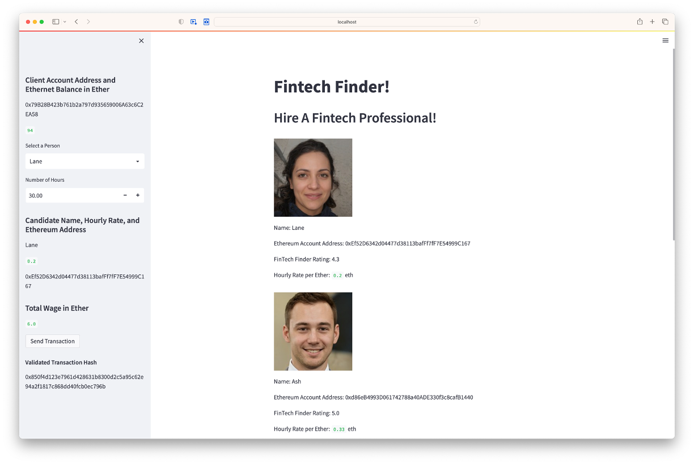

# Blockchain_Wallet

This is a blockchain wallet Fintech Finder demonstration app in the form 
of a Fintech client looking to hire professionals.

The application imports ethereum wallet functions (generate account, get balance, send transaction) from 'crypto_wallet.py'

 

----

## Technologies

This application uses the following package:

* [Streamlit](https://streamlit.io)

This application uses Ganache as the 'local' Ethereum blockchain network for testing purpose.

* [Ganache](https://trufflesuite.com/ganache/)

 

---

## Usage

In Windows GitBash or Mac Terminal app, run "streamlit run fintech_finder.py". This will launch the default browser showing the Fintech Finder application.

The mnemonic seed phrase (provided by Ganache) must be included in the .env text file in the following format:

        MNEMONIC = 'MNEMONIC SEED PHRASE HERE FROM GANACHE'

The client's wallet is shown under the ACCOUNTS tab in Ganache. The first address (INDEX 0) is the one used in this application as the client's wallet address.

 

The transactions and the associated hashes can be seen at the TRANSACTIONS tab in Ganache.

 

This image shows the details of the first transaction/payment.

 

---

## Contributors

This application is written by James Tan, with code snippets provided UBC Extension.

 

---

## License

MIT.